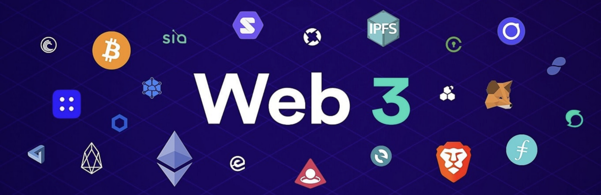

# Web 3.0 Crash Course

[Watch the Insane Future of Web 3.0 and Metaverse Video in Urdu](https://www.youtube.com/watch?v=eEz1rnmCfn4)

## All Students Should Start Preparing For JavaScript Entry Test

All students are required to start learning JavaScript immediately, even before the program starts. If the number of students who apply for the program are greater than the seats available the applicants will be selected on the basis of JavaScript Quiz scores, which will be take at the start of classes. 

[Watch JavaScript by Zeeshan Hanif to prepare for the Entry Test](https://www.youtube.com/playlist?list=PLKvqnz8z1zWQdc0NSLknxmxBch5gLOqyo)

Note: You will asked to take a Javascript Entry Test at the start of classes.

## Outcome for Students

The students who graduate from this program will be able to earn $50 per hour, to begin with. This will be a great opportunity for students and professionals of Pakistan. 

[Blockchain Developer Salary - Jun 2022](https://web3.career/web3-salaries/blockchain-developer)

[Web3 Salaries Soar to $750,000 for Rank-and-File Devs](https://thedefiant.io/web3-soaring-salaries/)

## Web 3.0 Crash Course

You can think of the stack which we will cover in this course in terms of layers. The first layer is the Web 2.0 technologies which provide the tools to develop 2D frontends and a highly sclable and cost effective cloud backend. The second layer is the Web 3.0 technolgies that is built using the first layer and the Ethererum blockchain. 

[Why You Should Learn Web 2.0 Before Getting into Web 3.0](https://javascript.plainenglish.io/why-you-should-learn-web-2-0-before-getting-into-web-3-0-d251625990db) 

The Web 2.0 full stack applicatios are build using these technologies, this is the first layer of our development stack:

1. [Typescript Programming Language for Front-end and Backend Development](https://www.typescriptlang.org/)
2. [Visual Studio Code Editor](https://code.visualstudio.com/)
3. [Front-end Web 2.0 Development Using Next.js](https://nextjs.org/)
4. [Infrastructure as Code using AWS Cloud Development Kit](https://aws.amazon.com/cdk/)
5. [AWS Lambda for Serverless Computing](https://aws.amazon.com/lambda/)
6. [Panacloud CLI for API Development](https://www.npmjs.com/package/@panacloud/cli)
7. [Amazon Aurora Serverless v2 PostgreSQL 13-compatible edition](https://docs.aws.amazon.com/AmazonRDS/latest/AuroraUserGuide/aurora-serverless-v2.html)

This Web 2.0 stack can be easily extended to develop Web 3.0 Dapps using these technologies, this is the second layer:

1. [Ethereum Blockchain](https://ethereum.org/en/)
2. [Solidity Smart Contract Programming Language](https://docs.soliditylang.org/)
3. [OpenZepllin Smart Contracts](https://www.openzeppelin.com/contracts)
4. [Hardhat Ethereum Development Envirnoment](https://hardhat.org/)
5. [Ethers.js](https://docs.ethers.io/v5/)
6. [Metamask Wallet](https://metamask.io/)
7. [Alchemy](https://www.alchemy.com/)
8. [The Graph](https://thegraph.com/en/)
9. [Chainlink](https://chain.link/)

For more details check out the [Panacloud Web 3 Learning Repo](https://github.com/panacloud-modern-global-apps/defi-dapps-solidity-smart-contracts)

## Program Details:

## Module I: Web 3.0 Theory

[Mastering Blockchain Book](https://www.packtpub.com/product/mastering-blockchain-third-edition/9781839213199)

[Download Mastering Blockchain Book](https://pk1lib.org/book/11269630/9409cf)

## Module II: Object Oriented Programming using Typescript

The student should learn HTML, CSS, and Javascript by going through these videos:

[Learn HTML by Hira Khan](https://www.youtube.com/playlist?list=PLKvqnz8z1zWQ3BALy86tIXICkG874wAc6)

[Learn CSS Intro by Hira Khan](https://www.youtube.com/playlist?list=PLKvqnz8z1zWQSWIen_zUSEBmtqzPLuRob)

[Learn JavaScript by Zeeshan Hanif](https://www.youtube.com/playlist?list=PLKvqnz8z1zWQdc0NSLknxmxBch5gLOqyo)

We will cover the following in class:

[Essential TypeScript 4: From Beginner to Pro](https://www.oreilly.com/library/view/essential-typescript-4/9781484270110/)

[Book Source Code](https://github.com/Apress/essential-typescript-4)

## Module III: Advanced Web 2.0 Development using Next.js

[WHAT IS NEXT JS AND WHY SHOULD YOU USE IT IN 2022?](https://pagepro.co/blog/what-is-nextjs/)

[Real-World Next.js](https://www.packtpub.com/product/real-world-next-js/9781801073493)

[Next.js Learning Repo](https://github.com/panacloud-modern-global-apps/nextjs)

## Module IV: Smart Contract Development with Solidity and Hardhat

[Solidity Programming Essentials - Second Edition](https://www.packtpub.com/product/solidity-programming-essentials-second-edition/9781803231181)

[Solidity Learning Repo](https://github.com/panacloud-modern-global-apps/defi-dapps-solidity-smart-contracts)

### Class Videos

[Class 1: Steps 00 and 01: Blockchain, Ethereum Smart Contract, and Hardhat Intro in English on Facebook](https://www.facebook.com/fb.anees.ahmed/videos/611810023268930)

[Class 1: Steps 00 and 01: Blockchain, Ethereum Smart Contract, and Hardhat Intro in English on YouTube](https://youtu.be/24Nl4fVGH6g)

[Class 1: Step 00 and 01: Blockchain, Ethereum Smart Contract, and Hardhat Intro in Urdu on Facebook](https://www.facebook.com/Ai.SirQasim/videos/394282572468467)

[Class 1: Step 00 and 01: Blockchain, Ethereum Smart Contract, and Hardhat Intro in Urdu on YouTube](https://youtu.be/wXFi1wkn_5o)

[Class 2: Step 03 Part 1 - Solidity Tutorial in English on Facebook](https://web.facebook.com/trouble.maker121/videos/448321510117377)

[Class 2: Step 03 Part 1 - Solidity Tutorial in English on YouTube](https://youtu.be/NcZMDsjJ-OA)

[Class 2: Step 03 Part 1 - Solidity Tutorial in Urdu on Facebook](https://web.facebook.com/Ai.SirQasim/videos/322455473108467)

[Class 2: Step 03 Part 1 - Solidity Tutorial in Urdu on YouTube](https://youtu.be/rfnAsGNH14E)

[Class 3: Step 03 Part 2 - Solidity Tutorial in English on Facebook](https://web.facebook.com/fb.anees.ahmed/videos/7151001034909886)

[Class 3: Step 03 Part 2 - Solidity Tutorial in English on YouTube](https://youtu.be/mXuY7Sp5jmw)

[Class 3: Step 03 Part 2 - Solidity Tutorial in Urdu on Facebook](https://web.facebook.com/Ai.SirQasim/videos/2126325780860897)

[Class 3: Step 03 Part 2 - Solidity Tutorial in Urdu on YouTube](https://youtu.be/nhlchB7Mij4)

[Class 3 Part 2: Step 03 Part 2B - Solidity Tutorial in Urdu on YouTube](https://youtu.be/J3C9KGG61pA)

[Class 4: Step 03 Part 3 - Solidity Tutorial in English on Facebook](https://www.facebook.com/fb.anees.ahmed/videos/319111146832336)

[Class 4: Step 03 Part 3 - Solidity Tutorial in English on YouTube](https://youtu.be/t-8fHUpbjb8)

[Class 4: Step 03 Part 3 - Solidity Tutorial in Urdu on Facebook](https://www.facebook.com/Ai.SirQasim/videos/1812389385622735)

[Class 4: Step 03 Part 3 - Solidity Tutorial in Urdu on YouTube](https://youtu.be/nbG_FhoCLoE)

[Class 5: Step 03 Part 4 - Solidity Tutorial in English on Facebook](https://www.facebook.com/zeeshanhanif/videos/1378858009232147)

[Class 5: Step 03 Part 4 - Solidity Tutorial in English on YouTube](https://youtu.be/scga3Cy-NFQ)

[Class 5: Step 03 Part 4 - Solidity Tutorial in Urdu on Facebook](https://www.facebook.com/Ai.SirQasim/videos/495841945575417)

[Class 5: Step 03 Part 4 - Solidity Tutorial in Urdu on YouTube](https://youtu.be/Rq7q8ztRs70)

[Class 6: Step 03 Part 5 - Solidity Tutorial in English on Facebook](https://www.facebook.com/zeeshanhanif/videos/352545383194950)

[Class 6: Step 03 Part 5 - Solidity Tutorial in English on YouTube](https://youtu.be/56StWx7V4vM)

[Class 6: Step 03 Part 5 - Solidity Tutorial in Urdu on Facebook](https://www.facebook.com/Ai.SirQasim/videos/2210008845814579)

[Class 6: Step 03 Part 5 - Solidity Tutorial in Urdu on YouTube](https://youtu.be/lyQUb7vuvpY)

[Class 7: Step 03 Part 6 - Solidity Tutorial in English on Facebook](https://www.facebook.com/zeeshanhanif/videos/474397740982913)

[Class 7: Step 03 Part 6 - Solidity Tutorial in English on YouTube](https://youtu.be/dNel-1J7WAo)

[Class 7: Step 03 Part 6 - Solidity Tutorial in Urdu on Facebook](https://www.facebook.com/Ai.SirQasim/videos/1114838999266069)

[Class 7: Step 03 Part 6 - Solidity Tutorial in Urdu on YouTube](https://youtu.be/ynRJq88pJQo)

[Class 8: Step 04 - Chapter 02 Textbook in English on Facebook](https://www.facebook.com/zeeshanhanif/videos/480580873784502)

[Class 8: Step 04 - Chapter 02 Textbook in English on YouTube](https://youtu.be/eLxMxhfEZ9g)

[Class 8: Step 04 - Chapter 02 Textbook in Urdu on Facebook](https://www.facebook.com/Ai.SirQasim/videos/647528262963595)

[Class 8: Step 04 - Chapter 02 Textbook in Urdu on YouTube](https://youtu.be/HYgh3Nix7jQ)

[Class 9: Step 04 and 05 - Chapter 02 and 03 Textbook in English on Facebook](https://www.facebook.com/zeeshanhanif/videos/7014356888634818)

[Class 9: Step 04 and 05 - Chapter 02 and 03 Textbook in English on YouTube](https://youtu.be/zGvMRE6rflU)

[Class 9: Step 04 and 05  - Chapter 02 and 03 Textbook in Urdu on Facebook](https://www.facebook.com/Ai.SirQasim/videos/1050761768987494)

[Class 9: Step 04 and 05 - Chapter 02 and 03 Textbook in Urdu on YouTube](https://youtu.be/1DmqDVVv0Wg)

[Class 10: Step 6A - Chapter 07 Textbook in English on Facebook](https://www.facebook.com/zeeshanhanif/videos/1248604509216381)

[Class 10: SStep 6A - Chapter 07 Textbook in English on YouTube](https://youtu.be/rgEbkqhr-2g)

[Class 10: Step 6A - Chapter 07 Textbook in Urdu on Facebook](https://www.facebook.com/Ai.SirQasim/videos/703398320695153)

[Class 10: Step 6A - Chapter 07 Textbook in Urdu on YouTube](https://youtu.be/VFIItvWFfOY)

[Class 11: Step 6B - Vacation Project Assignment in English on Facebook](https://www.facebook.com/inampaki/videos/717989595995770)

[Class 11: SStep 6B - Vacation Project Assignment in English on YouTube](https://youtu.be/MXINU6LLC2A)

[Class 11: Step 6B - Vacation Project Assignment in Urdu on Facebook](https://www.facebook.com/Ai.SirQasim/videos/274105618254173)

[Class 11: Step 6B - Vacation Project Assignment in Urdu on YouTube](https://youtu.be/hLVxr-1seaA)

### Blockchain Project 1: Create a Token and Launch ICO/IEO/IDO

As you probably know, the ICO ("Initial Coin Offering") industry has been booming, and it's completely reinventing the way new startups kickstart themselves. In fact, go have a look at [Wikipedia's list of highest crowdfunding projects](https://en.wikipedia.org/wiki/List_of_highest-funded_crowdfunding_projects), and you'll notice that blockchain projects absolutely dominate the list.

[Understand the difference between IDO vs. IEO vs. ICO](https://phemex.com/blogs/what-is-a-dex-ido)

Also check these links for latest listings:

[ICO list at ICO Drops](https://icodrops.com/). 

[ICO List of Best New Initial Coin Offerings](https://topicolist.com/).

[Top-Rated Crypto Token Sales: List of New ICOs, STOs, IEOs and IDOsTop-Rated Crypto Token Sales: List of New ICOs, STOs, IEOs and IDOs](https://cryptototem.com/ico-list/)

[ICO List Online](https://www.icolistingonline.com/)

[Binance IEO List](https://coincodex.com/ieo-list/binance/)

[Binance Launchpad](https://www.coinspeaker.com/ieo/platform/binance-launchpad/)

[IEO List](https://icomarks.com/ieo)

[Polkastarter](https://polkastarter.com/)

Project Part 1: How to Launch a IEO on Binance Lauchpad

[Read how to Lauch an IEO](https://appinventiv.com/blog/how-to-launch-an-ieo/)

Your first task of the project is to make a google slides presentation on how to start a IEO on the [Binance Launch Pad](https://www.binance.com/en/support/faq/94ed108ce89d44ab8602aa3c476dfb04).

Note: Also document the alternatives to Binance Launchpad.

Project Part 2: How to Launch a IDO on Polkastarter

Review the [list of top fundraising platforms](https://cryptorank.io/fundraising-platforms)

Your second task of the project is to make a google slides presentation on how to start a IDO on the [Polkastarter](https://polkastarter.com/).

Project Part 3: Create a Pako Token

By creating an token and related contracts, you'll also learn how to handle money sent to to your contracts, which should come in handy if you want to create some kind of paid decentralised service in the future.

Therefore, for the sake of this chapter, let's imagine that our  Pako DApp uses its own coin – the Pako Token. We will create two contracts – one for the token itself and one for the token crowd sale (the ICO).

Now Create your own Pako ERC20 Token and deploy it on a testnet. The Token should be to use openzeppelin contracts. You will use Harkhat development envirnoment. Also, write at least 20 automated tests. We will be using the Solidity and Typescript for dvelopment.

Project Part 4: Develop Crowd Sale Contract

This contract will be responsible to allow users to exchange ETH for our Pako Token. In order to do that we need to
Set a price for our token (1 ETH = 100 Pako Token)

Implement a payable buyToken() function. 

Emit a BuyTokens event that will log who’s the buyer, the amount of ETH sent and the amount of Token bought

Transfer 75% the Tokens to the Crowd Sale contract at deployment time. i.e. Right after the contract is deployed, we want the token contract to send 75% of our token supply to it. While 25% remain in our personal "owner" account.

Transfer the ownership of the Crowd Sale contract (at deploy time) to our frontend address so that we are able to withdraw the ETH.

You can use the [openzeppelin crowd sale contracts](https://docs.openzeppelin.com/contracts/4.x/crowdsales), however you will have to update the code to the latest solidity version.

Also write exentisive tests, for example we will simply send a transaction of 1 ETH from a random account to the contract. After the transaction, we should expect the account to have received Pako, while the contract's balance should have been reduced.

Note: Before you get started writing the token contract we suggest you review [access control](https://docs.openzeppelin.com/contracts/4.x/access-control).

Project Part 5: Trying it with MetaMask

While it's always good to test your code, it's often more satisfying to see the results of your work wrapped in a nice UI. Let's see how we can deploy our contracts and get some Pako tokens into our MetaMask wallet!

We start by running our deployment scripts for the test network so that the new token contracts are uploaded and deployed.

When it's done, take note of what addresses the contracts was uploaded to and copy it!

Now head to MetaMask, and send a transaction of 1 ETH to the crowd sale contract address. If your MetaMask wallet doesn't have any ethers, remember that you can use any faucet.

After the transaction has confirmed, you might be confused about why you can't see any tokens in your wallet. It turns out that you need to manually add the token address in MetaMask in order to "register" it – after all, there are so many tokens out there, there's no way MetaMask could list them all by default!

To do this, open the side menu and click on the "Add token" button to get started:

Once you're on the token page, click on "Add custom token" and paste in the token contract's address in the address field.

After confirming that you want to add the token, you should be able to see your Pako balance right next to your ETH balance in the wallet. How cool!

Project Part 6: Trying it with Multisignature Wallets

[Read](https://www.coindesk.com/tech/2020/11/10/multisignature-wallets-can-keep-your-coins-safer-if-you-use-them-right/)

Now use [Gnosis Safe]{https://gnosis-safe.io/) with multi-sigs to do what you did in the last part.

Project Part 7: Sending Tokens using Ethers.js 

Write a Typescript program to send Pako Token to some friend's address using Ethers.js.

[You may follow this tutorial](https://ethereum.org/en/developers/tutorials/send-token-etherjs/)

Project Part 8 Advance: Create, Deploy, Mint, and Sell a NFT

[Read this NFT tutorial series](https://ethereum.org/en/developers/tutorials/how-to-write-and-deploy-an-nft/)

Create a NFT contract using the [OpenZepplen ERC721 NFT Standard](https://docs.openzeppelin.com/contracts/4.x/erc721).

You may use the [Preset ERC721 contract](https://docs.openzeppelin.com/contracts/4.x/erc721#Presets).

Deploy your NFT contract on a testnet, mint it, and view it on the MetaMask wallet and list it on [OpenSea Marketplace](https://opensea.io/) for sale.

[Implement a ERC721 Market](https://ethereum.org/en/developers/tutorials/how-to-implement-an-erc721-market/)

## Module V: Dapp Development using Ethers.js, Next.js, and Solidity

[Ethers](https://docs.ethers.io/v5/)
